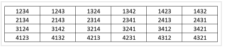
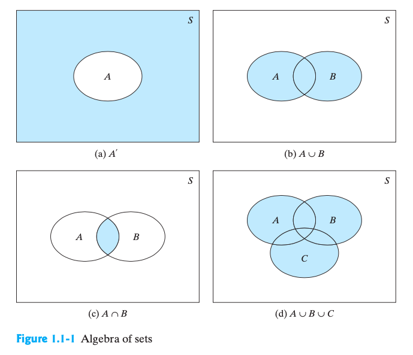
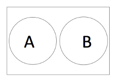
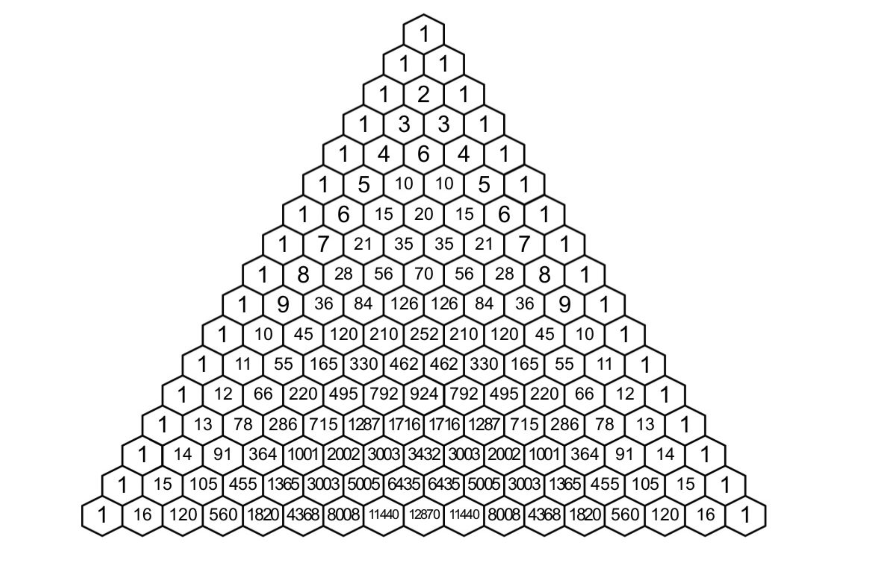
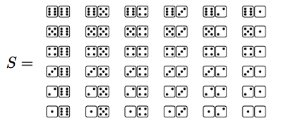
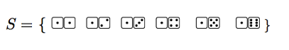
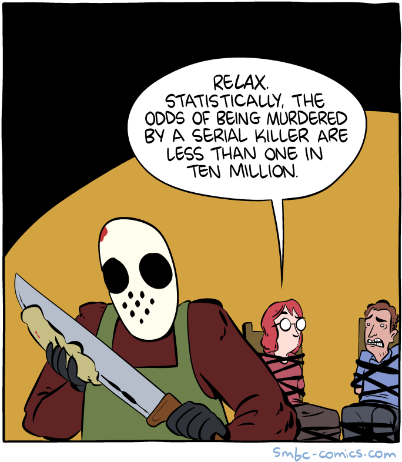

```{r, echo = FALSE, message=FALSE, warning = FALSE}
library(tidyverse)
```

\pagebreak

# 2.1 Introduction

**What is Probability?**

Colloquially, a measure of one's belief in the occurrence of a future event.

Probability is a mathematical framework to describe and analyze random phenomenon.

**Okay.. so what are random phenomenon?**

Anything we cannot predict with certainty

-   e.g. weather, score of a soccer game, score on a test, arrival time
    of a flight, protection of vaccine, whether your roommate will wash
    the dishes, etc
    
Concept of probability is necessary in work with physical, biological, or social mechanisms that generate observations that cannot be predicted with certainty.

An alternative definition: probability is the mathematics of uncertainty.

Even if random events can't be predicted with certainty, the relative frequency with which they occur in a long series of trials is often remarkably stable.

## A goofy (and absurd) example: Random babies

::: {.activitybox data-latex=""}

*Courtesy of Allan Rossman (2019)*

Imagine that a hospital returns newborn babies to their mothers at
random... 

Use your intuition to arrange the following events in order, from least
likely to most likely:

A.   None of the four mothers gets the correct baby.
B.   At least one of the four mothers gets the correct baby.
C.   All of the four mothers gets the correct baby.

How should we investigate the real order? Start by simulating...

1.  Write the first names of 4 babies on your 4 index cards
2.  Take a blank sheet of paper and divide it into four sections
3.  Write the last name of a mother in each section. Make sure you know
    which baby matches to which mother - try using alliterations (e.g.
    Bob Barker)
4.  Shuffle the cards (babies) and randomly distribute them to the
    sections of the sheet (mothers)
5.  How many matches occurred? Write this number down
6.  Repeat Steps 4-5

:::

\pagebreak

::: {.activitybox data-latex=""}

### Random babies (cont'd)


**Class by-hand Simulation results:**

|Matches| Count \hspace{0.4in}| Fraction \hspace{0.4in}| Decimal |
|------|------|------|------|
|0| | | | 
|1| | | | 
|2 | | | | 
|3 | | | | 
|4 | | | | 

**Computer simulations**

Let's do this *many* more times: 

<http://www.rossmanchance.com/applets/randomBabies/RandomBabies.html>

+ Determine the approximate probability that **at least one** mother gets
the correct baby. 
    + Indicate two different ways to determine this. 
+ Interpret this (approximate) probability.\
\
\


If $P(A)$ = the long-run proportion of times event $A$ will occur, can
we determine that exact limiting value?

First need to determine all the possible outcomes:

```{r, echo = FALSE, fig.align="center", out.width="90%"}

```

+ Determine the number of matches for each outcome.  
+ Then count how many outcomes produce 0 matches, 1 match, and so on.  
+ Finally, divide by the total number of outcomes to determine the exact probabilities. Express these probabilities as fractions and also as decimals, with three decimal places of accuracy


|Matches| Count \hspace{0.4in}| Fraction \hspace{0.4in}| Decimal |
|------|------|------|------|
|0| | | | 
|1| | | | 
|2 | | | | 
|3 | | | | 
|4 | | | | 

:::

::: {.activitybox data-latex=""}

+ What is the exact (theoretical) probability that at least one mother gets the correct baby?
\
\
\
\
\
\
\
\

+ Finally, let's return to our original question... order these from least
likely to most likely:

  A.   None of the four mothers gets the correct baby.
  B.   At least one of the four mothers gets the correct baby.
  C.   All of the four mothers gets the correct baby.
\
\
\
\
:::

### So, what is Probability?

\textcolor{red}{\textbf{Probability}} = the proportion of outcomes of a
random experiment that terminate in the event A as the number of trials
of that experiment increases without bound. 

If an experiment is repeated $n$ times under essentially identical
conditions, and if the event $A$ occurs $n_A$ times, then as $n$ grows
large, the ratio $n_A/n$ approaches a fixed limit that is the
probability of event $A$. That is, $P(A) = n_A/n$

:::: {.highlightbox data-latex=""}
::: {.center data-latex=""}
Probability interpreted as the proportion of times an event occurs in
the long run
:::
::::

\pagebreak

# 2.2 Probability & Inference

### What does probability have to do with inference?

Consider a gambler who wishes to make an inference about the balance of a six-sided die. 

Hypothesis: the die is balanced (all 6 sides equally likely to occur; not weighted).

Wants to use real-world observations to evaluate the hypothesis (reject the theory if false). 

His data: 10 rolls of the die, all 1s. Rejects the hypothesis because even though ten 1s not an *impossible* result, he judges it to be an *improbable* one. 

His judgement is probably based on intuition. 

What if he got five 1s, and a mix of other numbers? Is that highly improbable? Or four 1s? Many events are in a grey area that intuition alone makes it difficult to guess the probability. 

We need a rigorous method for finding a number (a probability) that will agree with the actual relative frequency of occurrence of an event in a long series of trials. 

We need a **theory of probability** that will permit us to calculate the probability of observing specified outcomes, assuming that our hypothesized model is correct.

Set theory is a first set of tools that will help us in constructing probabilistic models for experiments. 

# 2.3 A Review of Set Notation

We use capital letters, $A, B, C$, etc to denote sets of points. E.g., if $a_1, a_2, a_3$ are elements in the set $A$, we write $$A = \{a_1, a_2, a_3\}$$

## Set Theory / Activity

```{r, echo = FALSE, out.width="65%", fig.align="center"}

```

\pagebreak

## Notation / terminology

$A \cup B$ is the \textcolor{red}{\textbf{union}} of $A$ and $B$

> Union = event $A$ occurs OR event $B$ occurs OR both

$A \cap B$ is the \textcolor{red}{\textbf{intersection}} of $A$ and
    $B$

> Intersection = event $A$ occurs AND event $B$ occurs

$\emptyset$ denotes the \textcolor{red}{\textbf{null}} or
    \textcolor{red}{\textbf{empty}} set

$A'$ is the \textcolor{red}{\textbf{complement}} of $A$ (our book uses $\overline{A}$, others use $A^c$)

> i.e. all elements in $S$ that are not in $A$

$A \subset B$ means $A$ is a \textcolor{red}{\textbf{subset}} of $B$ (all elements in $A$ are also in $B$)

\textcolor{red}{\textbf{Mutually Exclusive}} =
    \textcolor{red}{\textbf{Disjoint}} = Events that cannot occur
    simultaneously
$$A\cap B = \emptyset$$

::: {.activitybox data-latex=""}

**Example**: 

> Event A = stock market closes up today

> Event B = stock market closes down today

> A and B cannot both happen $\implies$ A & B are disjoint

```{r, echo = FALSE, out.width="20%", out.height = "20%", fig.align="center"}

```

:::

\textcolor{red}{\textbf{Mutually Exhuastive}}= a set of events that completely cover the sample space

$$A\cup B \cup C= S$$

::: {.activitybox data-latex=""}

**Example**: 

> Event A = patient's temperature increases

> Event B = patient's temperature decreases

> Event C = patient's temperature stays the same

> $\{A,B,C\}$ encompasses all posibilities $\implies$ mutually exhaustive

:::

## Laws of Set Algebra

::: {.highlightbox data-latex=""}

**Commutative Laws**

$$\begin{aligned}
A \cup B &= B \cup A \\
A \cap B &= B \cap A
\end{aligned}$$

:::

::: {.highlightbox data-latex=""}

**Associative Laws**

$$\begin{aligned}
(A \cup B) \cup C &= A \cup (B \cup C) \\
(A \cap B) \cap C &= A \cap (B \cap C)
\end{aligned}$$

:::

::: {.highlightbox data-latex=""}

**Distributive Laws**

$$\begin{aligned}
A \cap (B \cup C) &= (A \cap B) \cup (A \cap C) \\
A \cup (B \cap C) &= (A \cup B) \cap (A \cup C)
\end{aligned}$$

:::

::: {.highlightbox data-latex=""}

**DeMorgan's Laws**

$$\begin{aligned}
(A \cup B)' &= A' \cap B' \\
(A \cap B)' &= A' \cup B'
\end{aligned}$$

:::

# 2.4 A Probabilistic Model for an Experiment: The Discrete Case

## Some definitions

\textcolor{red}{\textbf{Experiment}} = process by which an observation is made.

\textcolor{red}{\textbf{Random experiment}} = process of observing the outcome of a chance event (i.e. the outcome of the experiment cannot be predicted with certainty).

> Random babies: process of randomly delivering 4 babies to 4 mothers (1 shuffle in our simulation = 1 random experiment)

Experiments can result in one or more outcomes, which are called \textcolor{red}{\textbf{events}}, denoted by capital letters (eg. A, B)

> Random babies example outcomes/events:

+ A: At least one baby delivered to its correct mother
+ B: Less than 4 babies delivered to their correct mothers
+ $E_0$: 0 babies delivered correctly
+ $E_1$: Exactly 1 baby delivered correctly
+ $E_2$: Exactly 2 babies delivered correctly
+ $E_4$: All 4 babies delivered correctly

Note that events can either be **compound** or **simple**. For example, if you observe $A$ (*at least one baby*), you will have also observed either $E_1, E_2$, or $E_4$. $A$ is an example of a compound event, because it can be decomposed into other simple events. 

A \textcolor{red}{\textbf{simple event}} is an event that cannot be decomposed. Each simple event corresponds to one and only one sample point. 

\textcolor{red}{\textbf{Sample space}} = the set of all possible simple outcomes/events for an experiment

> Random babies: {0,1,2,4 matches}

> Sample space = S (or sometimes $\Omega$)

\textcolor{red}{\textbf{Discrete sample space}} is one that contains either a finite or countable number of distinct sample points.

An *event* in a discrete sample space $S$ is a collection of sample points - that is, any subset of $S$. 


## What is Probability? (more formally)

::: {.highlightbox data-latex=""}

**Definition 2.6** Suppose $S$ is a sample space associated with an experiment. To every event $A$ in $S$ ($A$ is a subset of $S$), we assign a number $P(A)$, called the \textcolor{red}{\textbf{probability}} of $A$, so that the following axioms hold:  

1. $P(A) \geq 0;$
1. $P(S) = 1;$ 
1. if $A_1, A_2, A_3, ...$ are a series of pairwise mutually exclusive events (i.e., 
$A_i \cap A_j = \emptyset,$ if $i \neq j$), then
$$P(A_1 \cup A_2 \cup ... \cup A_k) = P(A_1) \cup P(A_2) \cup ... \cup P(A_k) = \sum_{i = 1}^kP(A_i)$$
for each positive integer $k$, and
$$P(A_1 \cup A_2 \cup A_3 \cup ... ) = P(A_1) \cup P(A_2) \cup P(A_3) \cup ... = \sum_{i = 1}^\infty P(A_i)$$
for an infinite, but countable, number of events

:::

Note: the definition states only the conditions an assignment of probabilities must satisfy; it does not tell us *how* to assign specific probabilities of events.

Example: Suppose a coin yielded 800 heads in 1000 tosses. Consider the experiment of one more toss of the same coin. 

+ Two possible outcomes (simple events): heads or tails
+ Definition of probability allows us to assign to these two simple events any two non-negative numbers that add to 1.
+ Could do 1/2 for each simple event.
+ Past data suggests P(heads) = 0.8 and P(tails) = 0.2 might be a more reasonable assignment. 

*Specific assignments of probabilities must be consistent with reality in order for the probabilistic model to be useful.*

## Probability Laws

::: {.highlightbox data-latex=""}

-   $P(A) = 1 - P(A')$

-   $P(\emptyset) = 0$

-   If $A \subset B$, then $P(A) \leq P(B)$

-   $0 \leq P(A) \leq 1$

- $P(A \cup B) = P(A) + P(B) - P(A \cap B)$ (Addition rule)
:::

The last law is known as the "Additional Rule" 

Must avoid "double counting" the intersection of the two events

```{r, echo = FALSE, out.width="25%", fig.align="center"}
knitr::include_graphics("./images/Venn_AB.png")
```

**Special case**: If $A$ and $B$ are disjoint, then $P(A \cup B) = P(A) + P(B)$ because $P(A \cap B) = 0$

# 2.5 Calculating the Probability of an Event: The Sample-Point Method

For discrete sample spaces, it suffices to assign probabilities to each simple event. 

::: {.activitybox data-latex=""}

**Example**: Toss a balanced six-sided die once.

+ What is one possible simple event?

+ What is the sample space? 
\


+ What is a reasonable probability for each sample point in $S$? Confirm that the first two properties of Definition 2.6 hold.
\
\
\
\
\


:::

::: {.highlightbox data-latex=""}

**The sample-point method** for calculating probability

1. Define the experiment and clearly determine how to describe one simple event.
2. Define the sample space by listing the simple events of the experiment
3. Assign probabilities to the sample points in $S$, making certain that $P(E_i) \geq 0$ and $\sum P(E_i) = 1$
4. Define the event of interest, $A$, as a specific collection of sample points. 
5. Find $P(A)$ by summing the probabilities of the sample points in $A$. 

:::

::: {.activitybox data-latex=""}

**Example**:

A fair coin is tossed 3 times, and the sequence of heads and tails is observed. What is the probability that at least two heads is observed? 

\
\
\
\
\
\
\
\
\
\
\
\


Define the following additional events: 

+ $B =  \{\text{at most two heads}\}$
+ $C = \{\text{heads on the 2nd toss}\}$
+ $D = \{\text{1 head and 2 tails}\}$

Find:

a) $P(A)$
\
\
b) $P(A \cap B)$
\
\
c) $P(B)$
\
\
d) $P(A \cap C)$
\
\
e) $P(D)$
\
\
f) $P(A \cup C)$
\
\
g) $P(B \cap D)$


\
\


:::

The sample-point method is direct and powerful, but is a bit of a bulldozer approach. It can be cumbersome to list all the events, and it can be susceptible to human error. Orderliness, computers, and the mathematical theory of counting (combinatorics) can help reduce effort and human error in carrying out the sample-point method for calculating probabilities. 

# 2.5 Tools for Counting Sample Points

Combinatorics can help you calculate the total number of sample points in a sample space $S$ or an event of interest $A$, which can provide a confirmation (or avoidance) of your listing of simple events. Sometimes counting methods are the only way to calculate a probability if the sample space is very large. 

::: {.activitybox data-latex=""}

If a sample space $S$ contains $N$ equiprobable sample points and an event $A$ contains exactly $n_A$ sample points, then $$P(A) = \frac{n_A}{N}$$

:::


## Multiplication Rule or "$mn$" Rule

::: {.activitybox data-latex=""}

**Example**:

A sandwich shop offers 3 types of bread and 4 meats. How many different sandwiches are possible?

> *Hint: think in terms of "slots" for each element of the sandwich, and ask how many ways to fill 1st slot, then 2nd etc.*

> *OR use a "TREE DIAGRAM" to enumerate all possibilities*

```{r, echo = FALSE, eval = FALSE, out.width="20%", out.height = "20%", fig.align="left"}
knitr::include_graphics("./images/1.2_tree_diagram.png")
```
\
\
\
\
\
\
\
\
\
\
\
\
:::

**General Rule**

::: {.highlightbox data-latex=""}

If procedure 1 has $m$ possible outcomes ($a_1, a_2, \dots a_m$), procedure 2 has $n$ possible outcomes ($b_1, b_2, \dots b_n$), it is possible to form $mn = m \times n$ composite outcomes, containing one element from each group. 

:::

This multiplication rule can be extended to any number of sets. 

::: {.activitybox data-latex=""}

Refer back to the experiment of tossing 3 coins. Use the extension of the $mn$ rule to confirm the number of sample points. 

\
\
\

:::

::: {.activitybox data-latex=""}

Suppose you randomly select 20 people from a population. Ignoring leap years and assuming there are only 365 possible distinct birthdays, find the number of points in the sample space $S$ for this experiment.

\
\
\
\
\
\ 
If we assume each of the possible sets of birthdays is equiprobable, what is the probability that each person in the 20 has a different birthday? 

Define $A$ = set of all 20-tuples where there are no repeat numbers. We need to find the number of sample points in $A$. 
\
\
\
\
\
\
\
\


:::

## Permutations

We've seen that sample points are often represented by a sequence of numbers or symbols (e.g., HHH). Often, it will be clear that the total number of sample points equals the number of distinct ways that the representative symbols can be arranged in sequence.

::: {.activitybox data-latex=""}

**Examples**

In how many ways can you arrange Art, Bud and Carl in 3 seats?

\
\
\


> In how many ways can you arrange Art, Bud, Carl and Dave in 4 seats?

\
\
\


> What if there are 10 people and 10 seats - how many arrangements?

> *Hint: think in terms of "slots" for the seats \_ \_ \_ \_ \_ \_ \_ \_ \_ \_ and ask how many ways to fill 1st seat, then 2nd given someone is in 1st etc.*

\
\
\
\

:::

\textcolor{red}{\textbf{Factorial}} = Total number of ways to order n (unique) subjects
$$n! = \text{"n factorial"} = n \times (n-1) \times \cdots \times 2 \times 1$$

::: {.activitybox data-latex=""}

**Example**:

What if there are 10 people and only 3 seats - how many arrangements?

> *Hint: think in terms of "slots" again...start with first slot*

\
\
\
\

:::

\textcolor{red}{\textbf{Permutation}} = an ordered arrangement of $r$ distinct objects. The number of ways of ordering $n$ distinct objects, taken $r$ at a time, is given by

$$_nP_r = n(n-1)(n-2)\cdots(n - r + 1)=\frac{n!}{(n-r)!}$$

In our example, 3 seats (slots) for 10 people: 10 x 9 x 8 x \_\_\_\_\_
we need to "remove" slots 7, 6, 5,...,1 from the factorial:

$$_{10}P_3 = \frac{10!}{(10-3)!} = \frac{10!}{7!} = \frac{10 \times 9 \times 8 \times \textcolor{red}{7 \times \cdots \times 1}}{\textcolor{red}{7 \times \cdots \times 1}} = 10 \times 9 \times 8$$


The Permutation formula $_nP_r = \frac{n!}{(n-r)!}$ is based on
**sampling WITHOUT replacement**

::: {.activitybox data-latex=""}

**Exercise:**

What if there are 10 people and only 3 seats -- but it is a RAFFLE of tickets to a show and each person can win more than one ticket (or all three). How many ways are there to choose 3 tickets in this scenario?

> *Hint: We choose 1st winner THEN REPLACE THAT NAME IN THE HAT before picking second winner.*

\
\
\
\
\
\

:::

For **sampling WITH replacement**: use $n^r$

$$n^3 = 10 \times 10 \times 10 = 1000$$

::: {.highlightbox data-latex=""}
**Theorem 2.3** The number of ways of partitioning $n$ distinct objects into $k$ distinct groups containing $n_1, n_2, \dots n_k$ objects, respectively, where each object appears in exactly one group and $\sum_{i = 1}^k n_i = n$ is 

$$N = \binom{n}{n_1 \ \ n_2 \ \cdots \ \ n_k} = \frac{n!}{n_1! n_2! \cdots n_k!}$$

:::

::: {.activitybox data-latex=""}

**Exercise**: A labor dispute has arisen concerning the distribution of 20 laboreres to four different construction jobs. The first job (considered to be very undesireable) requires 6 laborers; the other three jobs required 4, 5, and 5 laborers respectively. The dispute arose over an alleged random distribution of the laborers to jobs that placed all 4 members of a particular ethnic group on job 1. In considering whether the assignment represented injustice, a mediation panel desired the probability of the observed event. Determine the number of sample points in the sample space $S$ for this experiment. That is, determine the number of ways the 20 laborers can be divided into groups of the appropriate sizes to fill all the jobs. Then, find the probability of the observed event if it is assumed that the laborers are randomly assigned to jobs.
\
\
\
\
\
\
\
\
\
\
\
\
\
\
\
\
\
\
\
:::

## Combinations

Sometimes the *order* of sample points in a subset is unimportant, and all that matters is which sample points are chosen. 

::: {.activitybox data-latex=""}

**Exercise**:

What if there are 10 people and 3 identical prizes - how many
arrangements of prize winners if we don't care about order (i.e we just want to pick 3 people)?

> *Hint: for one set of 3 people, how many extra sets do we get if order mattered? That is, think of how many ways to order the letters ABC*

\
\
\
\

:::

\textcolor{red}{\textbf{Combination}} = Total number of ways pick to r (unique) subjects selected from n subjects (also known as a "distinguishable permutation")

$$_nC_r = \frac{_nP_r}{\textcolor{blue}{r!}} = \frac{n!}{(n - r)! \textcolor{blue}{r!}}$$
We "divide out" the extra cases where order changes. In our example, choosing 3 of 10 people for each combination of 3 we get 3! "extra" if we allow order to matter. Example, combination ABC:
\textcolor{blue}{ABC, \ ACB, \ BAC, \ BCA, \ CAB, \ CBA = 3! = \text{6 times counted in Permutation}}
$$_{10}C_3 = \frac{10!}{(10 - 3)! \textcolor{blue}{3!}} = \frac{10 \times 9 \times 8}{\textcolor{blue}{6}}$$
Helpful to "read" the mathematical notation
$$_nC_r = \text{"n choose r"}$$

::: {.activitybox data-latex=""}

Example: How many ways are there to have a 3 daughters among a family of 5 children? In other words, how many ways can 3 "Fs" be placed in 5 "slots"? 
\
\
\
\
\
\

:::


## Binomial Coefficients & Pascal's triangle

$$_nC_r = \binom{n}{r} = \frac{n!}{(n-r)!r!}$$
```{r, echo = FALSE, fig.align="center", out.width="70%"}

```

```{r, echo = FALSE, eval = FALSE, fig.align="center", out.width="50%"}
knitr::include_graphics("./images/PascalTriangleAnimated.gif")
```

**Video on Pascal's trianlge:** [https://ed.ted.com/lessons/the-mathematical-secrets-of-pascal-s-triangle-wajdi-mohamed-ratemi](https://ed.ted.com/lessons/the-mathematical-secrets-of-pascal-s-triangle-wajdi-mohamed-ratemi)

**Seeing Theory website:** [https://seeing-theory.brown.edu/compound-probability/index.html#section2](https://seeing-theory.brown.edu/compound-probability/index.html#section2)

\pagebreak

# 2.7 Conditional Probability and the Independence of Events

::: {.activitybox data-latex=""}

**Exercise:**

Roll two dice. Let Event B = the dice add to 4.

```{r, echo = FALSE, out.width="50%", out.height = "50%", fig.align="center"}

```

> **Q1**: Before rolling the dice, what is P(B)?

\
\
\
\

> **Q2**: Suppose I roll one dice and get a 1 (i.e. Event A = get a 1 on first dice). What is the probability of B now that A has occured?

\
\
\
\
\
\

:::

In Q2, we wanted the \textcolor{red}{\textbf{conditional probability}} - the probability that B will occur given A has already occurred.

$$P(B|A) = \text{probability of }B  \textbf{ given } A$$

Rolling a 1 reduced the sample space from 36 possible outcomes to 6:

```{r, echo = FALSE, out.width="50%", out.height = "50%", fig.align="left"}

```

With only 1 of these being a sum of 4 we get:

$$P(B|A) = \frac{1}{6}$$

::: {.activitybox data-latex=""}

What does Conditional Probability look like in a Venn Diagram?

```{r, echo = FALSE, out.width="50%", out.height = "50%", fig.align="center"}
knitr::include_graphics("./images/Venn_AB.png")
```

:::

::: {.highlightbox data-latex=""}

The \textcolor{red}{\textbf{conditional probability}} of an event B,
given that event A has occured, is defined by:

$$P(B|A) = \frac{P(A \cap B)}{P(A)} = \frac{P(A \text{ and } B)}{P(A)}$$

:::

Note that $P(A) > 0$

::: {.highlightbox data-latex=""}

Conditional probabilities satisfy the axioms of Probability:

-   $P(B|A) \geq 0;$
-   $P(A|A) = 1;$
-   $P(B'|A) = 1 - P(B|A)$
-   if $B_1, B_2, ... B_k$ are mutually exclusive events then
    $$P(B_1 \cup B_2 \cup ... \cup B_k | A) = P(B_1 | A) + P(B_2|A) + ... + P(B_k|A)$$

:::

```{r, echo = FALSE, out.width="40%", out.height = "40%", fig.align="center"}

```


# 1.4 Independent Events

FOR SPRING 2025 - UPDATE TO INCLUDE EXAMPLES FROM AGQ: https://askgoodquestions.blog/2021/04/26/95-independence-day-part-1/

PARTS 2 AND 3 ARE ALSO RELEVENT. MAKE PART 3 ABOUT "CONNECTED IN SERIES" EITHER GROUP WORK OR HOMEWORK - WOULD BE GOOD FOR ENGINEERING FOLKS

::: {.activitybox data-latex=""}

**Example: flipping 2 coins**

> Event A = heads on 1st flip

> Event B = tails on second flip

> Event C = tails on both flips

Define the events above and then compute the following probabilities

-   $P(B)$ 
-   $P(B|C)$ 
-   $P(B|A)$

\
\
\
\
\
\

:::


Statistical \textcolor{red}{\textbf{Independence}} = the occurance of
another event (A) has **no effect** on the probability of B occurring:
$$P(B|A) = P(B)$$ Which events are independent in the above example?


Recall that

$$\frac{P(A \cap B)}{P(A)} = P(B|A) \implies P(A \cap B) = P(B|A)\times P(A)$$

IF A and B are independent, this becomes:

$$P(A \cap B) = P(B|A)\times P(A) = P(B) \times P(A)$$

::: {.highlightbox data-latex=""}
**Definition 1.4-1**     Events $A$ and $B$ are
\textcolor{red}{\textbf{independent}} if and only if
$P(A\cap B) = P(A)P(B).$ Otherwise, $A$ and $B$ are called
\textcolor{red}{\textbf{dependent}} events.
:::

::: {.highlightbox data-latex=""}
**Theorem 1.4-1**     If $A$ and $B$ are independent events, then the
following pairs of events are also independent:

(a) $A$ and $B'$  
(b) $A'$ and $B$  
(c) $A'$ and $B'$
:::

PROOF:

\
\
\
\
\
\
\
\
\
\
\
\
\


::: {.activitybox data-latex=""}

**Exercise:**

An urn contains four balls numbered 1, 2, 3, and 4. One ball is to be drawn at random from the urn. Let the events $A$, $B$, and $C$ be defined by $A = \{1,2\}$, $B = \{1,3\}$, and $C = \{1, 4\}$. Then $P(A) = P(B) = P(C) = 1/2$. Are pairs of events $AB, AC \text{ and } BC$ independent?

\
\
\
\
\
\
\
\
\
\
\
\
\

:::

## Mutual Independence

::: {.highlightbox data-latex=""}

**Definition 1.4-2**     Events $A$, $B$, and $C$ are
\textcolor{red}{\textbf{mutually independent}} if and only if the
following two conditions hold:

1.  $A$, $B$, and $C$ are pairwise independent; that is,
    $$P(A\cap B) = P(A)P(B),$$ $$P(A\cap C) = P(A)P(C),$$ and
    $$P(B\cap C) = P(B)P(C)$$
2.  $P(A \cap B \cap C) = P(A)P(B)P(C).$

:::

::: {.activitybox data-latex=""}


**Exercise (cont'd)**:

Are the events $A$, $B$, and $C$ in the urn exercise mutually
independent?

\
\
\
\
\
\

:::

::: {.activitybox data-latex=""}

**Example**:

Of a group of patients having injuries, 28% visit both a physical therapist and a chiropractor and 8% visit neither. Say that the probability of visiting a physical therapist exceeds the probability of visiting a chiropractor by 16%. What is the probability of a randomly selected person from this group visiting a physical therapist?

\
\
\
\
\
\
\
\
\
\

:::


# 1.5 Bayes Theorem

RE-DO THIS WITH EXAMPLES FROM AGQ: https://askgoodquestions.blog/2020/10/19/68-knowing-or-guessing/

::: {.activitybox data-latex=""}

**Example:**

*TRUE STORY (from a previous APU prof)*

After giving blood one year, Dr. S. received a letter saying the blood was rejected due to a positive test result for a Hepatitus A virus. The letter further stated this was "nothing to worry about"...?!? Suppose some research reveals that only 1% of people in the U.S. have HepA. The blood screening test is known to be correct 99% of the time when the person has the disease and 95% when the person does not. Should Dr. S. have worried? 

\

Define (two) events: 

\
\
\

What probabilities do we know? 

\
\
\

What probabilities do we want to know? 

\
\

Create a tree diagram:

\
\
\
\
\
\
\
\
\
\
\
\
\
\

:::

## Bayes' Rule

$$P(A|B) = \frac{P(A \cap B)}{P(B)} = \frac{P(B|A)P(A)}{P(B)}$$

More generally, for $k$ possible outcomes (in our example $k=2$):

$P(A_k|B) = \frac{P(A_k)P(B|A_k)}{P(B)}=\frac{P(A_k)P(B|A_k)}{\sum_{i = 1}^mP(A_i)P(B|A_i)}, \ \ \ \ k = 1, 2, ..., m$

+ Numerator is simply re-writing the intersection REVERSING THE CONDITIONAL PROBABILITY
+ Denominator is known as the **Law of Total Probability**
    $$\begin{aligned}
    P(B) &= \sum_{i = 1}^mP(A_i \cap B)\\
    &= \sum_{i = 1}^mP(A_i)P(B|A_i)
    \end{aligned}$$ 

## Bayes' Terminology

\textcolor{red}{\textbf{Prior probability - }}$P(A_k)$ the probability BEFORE we observe information B

\textcolor{red}{\textbf{Posterior probability - }}$P(A_k|B)$ the probability AFTER we observe B ... "updated" probability of the event
based on "new data/information"

<!-- ::: {.activitybox data-latex=""} -->

<!-- **Example:** -->

<!-- A hospital receives two fifths of its flu vaccine from Company A and the remainder from Company B. Each shipment contains a large number of vials of vaccine. From Company A, 3% of the vials are ineffective; from Company B, 2% are ineffective. A hospital tests $n = 25$ randomly selected vials from one shipment and finds that 2 are ineffective. What is the conditional probability that this shipment came from Company A? -->

<!-- > *Hint: define C to be the event that 2/25 vials are ineffective* -->

<!-- \ -->
<!-- \ -->
<!-- \ -->
<!-- \ -->
<!-- \ -->
<!-- \ -->
<!-- \ -->
<!-- \ -->
<!-- \ -->
<!-- \ -->
<!-- \ -->
<!-- \ -->
<!-- \ -->
<!-- \ -->

<!-- ::: -->

## Let's Make a Deal (The Monty Hall Problem)

::: {.activitybox data-latex=""}

There are 3 doors, one with a big prize behind it. You picked one of 3 doors. The dealer then revealed one of the doors you did not selected...not the big prize. He offers you the chance to keep your door or change to the remaining door. **Should you switch doors?**
\
Without loss of generality, assume you choose door A. Use Bayes' theorem to calculate the probability the BIG PRIZE is behind your door. What is the best strategy? When the host reveals a goat behind B (or C), should you switch to C (or B), or stick with A?  How does the dealer opening one door update the probability for each door?
\
*Hint: Set up a tree diagram with the three doors (and their probability of containing the prize) as the first set of branches, and the hosts' choice "B" or "C" as the second set of branches. Then, determine how to represent P(Win|Stay) and P(Win|Switch) in terms of these events A, B, C.* 
\
\
\
\
\
\
\
\
\
\
\
\
\
\
\
\
\
\
\
\

:::

\pagebreak

# Chapter 2 Group Work Practice

1. How many four-letter code words are possible using the letters in IOWA if:

    a. The letters may not be repeated?
    b. The letters may be repeated? 

2. Three students (S) and six faculty members (F) are on a panel discussing a new college policy.

    a. In how many different ways can the nine participants be lined up at a table in front of the auditorium?
    a. How many lineups are possible if you only care about where the students are placed in relation to faculty? In other words, how many ways are there to choose 3 seats to place the students in (or alternatively, choose 6 seats to place the faculty in)?
    a. For each of the nine participants, you are to decide whether the participant did a good job or a poor job stating their opinion of the new policy; that is, give each of the nine participants a grade of G or P. How many different "scorecards" are possible?
    
3. The NBA Finals continues until either the Western Conference team or the Eastern Conference team wins four games. How many different orders are possible (e.g. WEEWWW means the Western Conferences team wins in six games) if the series lasts....
    
    a. four games? 
    a. five games? *Hint: start by focusing on the number of ways the Western Conference can win in 5. And note that if the West wins in 5, the results are of the form _ _ _ _ W*
    a. six games?
    a. seven games?

4. Suppose that 78% of the students at a particular college have a TikTok account and 43% have a Twitter account. Using only this information, 

    a. what is the largest possible value for the percentage who have both a TikTok account and a Twitter account?  Describe the (unrealistic) situation in which this occurs.
    b. what is the smallest possible value for the percentage who have both a TikTok account and a Twitter account?  Describe the (unrealistic) situation in which this occurs.
    
| | Twitter | No Twitter | Total|
|----|-----|-----|------|
TikTok | | | 0.78
No TikTok | | | 0.22
Total | 0.43 | 0.57 | 1.00
    
 > Now assume you know that 36% of students have both a TikTok and a Twitter account.
    
> c. What percentage of students have at least one of these accounts?
> d. What percentage of students have neither of these accounts?
> e. What percentage of students have one of these accounts but not both?

5. Let $A_1$ and $A_2$ be the events that a person is left- eye dominant or right-eye dominant, respectively. When a person folds their hands, let $B_1$ and $B_2$ be the events that the left thumb and right thumb, respectively, are on top. A survey in one statistics class yielded the following table:

| | $B_1$ | $B_2$ | Totals |
|-----|---|---|-----|
|$A_1$ | 5 | 7 | 12 |
| $A_2$ | 14 | 9 | 23 |
| Totals | 19 | 16 | 35 |

> If a student is selected randomly, find the following probabilities:	
> (a)	$P(A_1 \cap B_1)$,	
> (b) $P(A_1 \cup B_1)$,    
> (c) $P(A_1|B_1)$,   
> (d) $P(B_2 | A_2)$.   
> (e) If the students had their hands folded and you hoped to select a right-eye-dominant student, would you select a “right thumb on top” or a “left thumb on top” student? Why?

```{r, echo = FALSE, eval = FALSE}
data.frame(c("$A_1$", "$A_2$", "Totals"), 
           b1 = c(5, 15, 19), 
           b2 = c(7, 9, 16), 
           Totals = c(12,23,35),
           row.names = 1) %>% 
  kable(col.names = c("$B_1$", "$B_2$", "Totals"))
```


